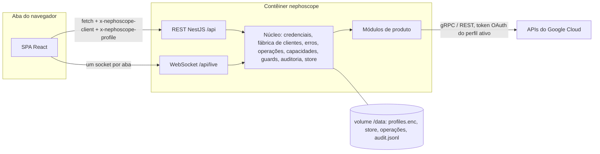

# SPEC-0001 — Plataforma

| | |
|---|---|
| **Status** | Rascunho |
| **Autor(es)** | |
| **Revisores** | |
| **Sistemas** | `apps/api` (NestJS) · `apps/web` (SPA React) · `packages/contracts` · imagem Docker e compose |
| **Spec relacionada** | [SPEC-0002 — Design system](./0002-design-system.md) · todas as specs de produto (0003 a 0010) se apoiam nesta |
| **Última atualização** | 2026-10-02 |
| **Versão** | 0.11 |

---

## 1. Resumo

O Nephoscope é um console web self-hosted para o Google Cloud que roda como **um único contêiner Docker**. Ele usa os SDKs Node oficiais do Google Cloud com as credenciais que você fornece: a chave em `GOOGLE_APPLICATION_CREDENTIALS`, mais quantas chaves salvas (perfis) você adicionar pela interface.

Esta spec define tudo em que as specs de produto se apoiam:
- como as credenciais são carregadas e guardadas;
- como o modelo sem login em localhost fica seguro;
- as convenções de REST e WebSocket e o modelo de erros;
- as operações de longa duração;
- a sondagem de capacidades, que adapta a UI ao que a chave consegue fazer;
- o modo somente leitura, o log de auditoria e a persistência local;
- o shell da aplicação e o runtime do contêiner.

---

## 2. Glossário

| Termo | Definição |
|---|---|
| **Perfil** | Uma credencial com a qual o Nephoscope pode agir. Tem nome, etiqueta de cor, flag de somente leitura e projeto padrão. |
| **Perfil Environment** | O perfil criado a partir de `GOOGLE_APPLICATION_CREDENTIALS`, ou das Application Default Credentials quando a variável não está definida. Id `env`. Existe sempre que uma credencial é encontrada e não pode ser excluído. |
| **Perfil salvo** | Um perfil adicionado pela interface, enviando ou colando uma chave JSON. Guardado criptografado no diretório de dados. |
| **Principal** | A identidade por trás de um perfil: e-mail de conta de serviço, e-mail de usuário ou identidade de workload. |
| **Perfil ativo** | O perfil com o qual uma aba do navegador está agindo. Escolhido por aba. |
| **Capacidade** | Se o perfil ativo pode usar um produto ou uma ação num projeto: a API do produto está habilitada e o perfil tem a permissão exigida. |
| **Sondagem de capacidades** | A consulta que calcula as capacidades: Service Usage para as APIs habilitadas e `projects.testIamPermissions` para as permissões. |
| **Mutação** | Toda requisição que altera estado no Google Cloud ou no Nephoscope. Marcada com `@Mutation()` no servidor. |
| **Operação (LRO)** | Uma operação de longa duração devolvida por uma API do Google. O Nephoscope a acompanha até terminar. |
| **Canal ao vivo** | Um fluxo nomeado sobre o único WebSocket de uma aba, como `logging.tail` ou `firestore.listen`. |
| **Problem** | Uma resposta de erro no formato RFC 9457 `application/problem+json`. |
| **Kit de recursos** | Os componentes compartilhados de páginas de lista e de detalhe que todo produto usa (§8.11). |
| **Nível de cobertura** | L1 Navegar, L2 Operar, L3 Profundo. Ver o [índice das specs](./README.md#níveis-de-cobertura). |
| **Diretório de dados** | `NEPHOSCOPE_DATA_DIR`, `/data` no contêiner. Guarda perfis, preferências, operações e o log de auditoria. |

---

## 3. Problema

O console do Google Cloud só funciona com uma sessão de conta Google. Uma chave de conta de serviço, forma comum de dar a uma equipe ou a uma ferramenta acesso a um projeto, não serve para abri-lo. Quem trabalha a partir de chaves recorre ao `gcloud`, a scripts ou a ferramentas avulsas por produto, e não existe projeto open source que transforme uma chave num console web completo.

Construir esse console é, antes de tudo, um problema de plataforma e só depois de produto. Dezenas de produtos têm as mesmas necessidades: credenciais, projetos, erros, operações de longa duração, fluxos ao vivo e travas de segurança. Se cada produto resolvesse isso sozinho, o console ficaria inconsistente e inseguro.

---

## 4. Objetivos

1. Montar uma chave, rodar um contêiner, abrir `localhost:8080` e operar projetos do Google Cloud a partir de um console web.
2. Alternar entre várias chaves (perfis) sem reiniciar, com sinais visuais claros de qual está ativa.
3. Adaptar a UI ao que a chave ativa consegue fazer: mostrar quais APIs estão desabilitadas e quais ações não são permitidas antes que o usuário tente.
4. Tornar seguro o modelo sem login em localhost contra os ataques que miram apps web locais (DNS rebinding, CSRF, sequestro de WebSocket entre sites).
5. Dar a todo produto as mesmas bases confiáveis: erros que explicam o que fazer, operações de longa duração acompanhadas, fluxos ao vivo, segurança de somente leitura e trilha de auditoria.

### Não-objetivos

- **Contas de usuário, login ou papéis dentro do Nephoscope.** O acesso é decidido por quem alcança o localhost (D-05). Revisitar só por meio de uma nova decisão.
- **Hospedar o Nephoscope como serviço compartilhado ou público.** É uma ferramenta local; cada pessoa roda a sua, a partir do código ou da imagem pública (D-27).
- **Substituir o `gcloud`.** O Nephoscope mostra o comando equivalente quando útil; não embrulha a CLI.
- **Shells interativos:** SSH, entrada no console serial, `kubectl exec`, Cloud Shell.
- **Cache de dados do Google Cloud para uso offline.** Os dados são lidos ao vivo das APIs.
- **Idiomas além do inglês na interface.**

---

## 5. Decisões tomadas

### D-01 — Um único contêiner autossuficiente

O NestJS serve a API REST e WebSocket e o SPA compilado a partir da mesma origem. Não há banco de dados externo: o estado local fica em arquivos JSON no diretório de dados (D-15).

**Racional:** a promessa é "monte uma chave e rode". Todo serviço extra (banco, cache, proxy reverso) seria configuração a cargo do usuário, e um SPA na mesma origem simplifica o modelo de segurança em localhost (D-05).

### D-02 — Stack

- **Backend:** NestJS 12 como projeto ESM com o adaptador Express, sobre Node 24 LTS.
- **Frontend:** SPA React 19 compilado com Vite (bibliotecas de UI na SPEC-0002).
- **Contratos compartilhados:** `packages/contracts` guarda schemas zod v4 e os tipos TypeScript derivados deles. O NestJS 12 aceita objetos Standard Schema nos decorators de rota (`@Body({ schema })`), então o mesmo schema valida a requisição no servidor e tipa a chamada no navegador. **O decorator só anexa metadados**: um `StandardSchemaValidationPipe` global é registrado no bootstrap; sem ele, nada é validado (CA-31). As constantes de runtime que não dependem do zod (códigos de problema, cabeçalhos, canais ao vivo, etiquetas de cor, limites) ficam em `@nephoscope/contracts/constants`, que o navegador importa sem empacotar os schemas; o pacote declara `sideEffects: false`.
- **Monorepo:** pnpm workspaces. Biome para lint e formatação. Vitest para testes unitários e de integração, Playwright para E2E.

**Racional:** o NestJS 12 saiu no 3º trimestre de 2026 com ESM nativo e suporte a Standard Schema, o que elimina classes de DTO e duplicação com class-validator. O usuário escolheu React + Vite (decisão do plano D-C); as três skills de design pressupõem React, Tailwind e Motion.

### D-03 — SDKs oficiais do Google, gRPC primeiro

- Usar o cliente `@google-cloud/*` de um produto sempre que existir (transporte gRPC, streaming, helpers de LRO).
- Usar os pacotes REST por API `@googleapis/*` para APIs sem cliente `@google-cloud/*` (por exemplo Firebase Rules, Error Reporting, leituras do Cloud Trace, Cloud DNS, contas de serviço do IAM).
- **Um mesmo módulo de produto pode usar os dois** quando o cliente gRPC não tem métodos que a API REST tem. Casos conhecidos:
  - a listagem global v1 do Cloud Run, via `@googleapis/run`;
  - os step entries do Workflows, via `@googleapis/workflowexecutions`;
  - upgrade e detach do Cloud Functions, via `@googleapis/cloudfunctions`;
  - o endpoint PromQL do Monitoring, via `@googleapis/monitoring`.
- **Exceção medida:** o Colab Enterprise usa só REST (`@googleapis/aiplatform`, `@googleapis/dataform`), porque o cliente gRPC do Vertex AI acrescenta cerca de 240 MB de memória ao carregar (SPEC-0010 D-02). Um produto sem streaming pode trocar o gRPC pelo REST quando a medição mostra que o gRPC estoura a NFR-03.
- Antes de construir um produto, comparar o documento de discovery REST com o cliente gRPC e registrar todo método que só exista em REST.
- Nunca depender do pacote monolítico `googleapis`.

**Racional:** o usuário pediu os SDKs do Google. Clientes gRPC são necessários para recursos de streaming (tail de logs ao vivo, listen do Firestore, Pub/Sub). Os clientes gRPC gerados às vezes ficam atrás das APIs REST, então um produto pode precisar dos dois. Pacotes REST por API mantêm a imagem pequena em comparação com o `googleapis`, que embute todas as APIs.

### D-04 — Credenciais: a chave do ambiente mais perfis salvos

*Decisão do plano D-A.*

- O **perfil Environment** vem de `GOOGLE_APPLICATION_CREDENTIALS`. Sem a variável, o Nephoscope tenta as Application Default Credentials (o arquivo padrão do gcloud e, depois, o servidor de metadados quando roda no Google Cloud).
- **Perfis salvos** são chaves JSON enviadas ou coladas na interface, guardadas criptografadas (D-15, CA-05).
- Tipos de credencial suportados: `service_account`, `authorized_user`, `external_account`, `impersonated_service_account` e o servidor de metadados para o perfil Environment.
- **O material de chave privada nunca sai do servidor.** O navegador só vê campos públicos (CA-06).

**Racional:** "plugar uma chave e rodar" é a promessa central, e quem trabalha a partir de chaves costuma ter mais de uma (por projeto, por ambiente). Alternar perfis pela interface evita reiniciar o contêiner com outra montagem.

### D-05 — Sem login, só localhost, com endurecimento de app web local

*Decisão do plano D-B.*

O Nephoscope não tem login. Ele só é alcançável a partir da máquina onde roda: o compose publica `127.0.0.1:8080:8080` e, fora do Docker, o servidor escuta em `127.0.0.1` por padrão.

Como um navegador pode ser induzido a falar com o localhost, o servidor também impõe:
- uma **lista de hosts permitidos** contra DNS rebinding (CA-12);
- um **cabeçalho customizado obrigatório** em toda chamada de API, mais as checagens de `Sec-Fetch-Site` e `Origin`, contra CSRF (CA-13, CA-14);
- uma **checagem de Origin no upgrade do WebSocket**, contra sequestro de WebSocket entre sites (CA-16);
- uma **Content Security Policy só `'self'`** e nenhum CORS (CA-15, CA-18).

**Token de acesso fora do loopback.** Incluir um host que não é de loopback em `NEPHOSCOPE_ALLOWED_HOSTS` transforma o Nephoscope num serviço na rede, e checagens de Host e Origin não detêm o `curl`. Por isso toda requisição que chega por um host desses precisa trazer o **token de acesso** (CA-71). O token é impresso uma vez na inicialização como uma URL que o grava como cookie `HttpOnly` e `SameSite=Strict`. `NEPHOSCOPE_REQUIRE_TOKEN=true` também o exige no loopback, para quem publica a porta de forma mais ampla que o compose.

**Racional:** o usuário escolheu "sem login, só localhost". Um app local sem autenticação continua exposto a qualquer página aberta no mesmo navegador: sem essas checagens, uma página maliciosa poderia fazer o navegador chamar a API do Nephoscope e agir com as chaves guardadas. As checagens não custam nada para a UI real, que está na mesma origem. O token não muda a experiência em localhost que o usuário escolheu; ele só se aplica quando o Nephoscope é exposto além disso de propósito.

### D-06 — Projeto na URL, perfil na aba

- O projeto ativo é o primeiro segmento de caminho de toda página com escopo de projeto: `/p/{projectId}/...`. Links podem ser compartilhados e salvos.
- O perfil ativo é escolhido por aba e enviado em toda requisição (cabeçalho `x-nephoscope-profile` e o `profileId` de cada assinatura ao vivo). O último perfil usado fica lembrado no navegador.

**Racional:** espelha o console do Google, onde o projeto está na URL. O perfil não vai na URL porque nomeia uma credencial local, sem significado em outra máquina.

### D-07 — Convenções REST no formato dos nomes de recurso do Google

- Os caminhos espelham os nomes de recurso, precedidos pelo produto: `/api/projects/{project}/run/locations/{location}/services/{service}`, `/api/projects/{project}/functions/locations/{location}/functions/{function}`. O prefixo separa produtos que usam o mesmo nome de coleção (`services` no Cloud Run e no App Engine, `jobs` no Cloud Run e no Scheduler).
- Recursos da própria instância ficam fora de `projects`: `/api/history/{key}` guarda os argumentos recentes (CA-53).
- Verbos sobre um recurso são subcaminhos: `POST .../jobs/{job}/run`.
- Listas aceitam `pageSize`, `pageToken`, `filter`, `orderBy` e devolvem `{ items, nextPageToken, unreachable? }`.
- Uma mutação que inicia uma operação de longa duração responde **202** com `{ operation }` (D-09). Uma mutação síncrona responde 200 com o recurso resultante.

**Racional:** espelhar os nomes de recurso torna a API previsível em mais de 40 produtos e deixa a UI repassar os nomes de recurso do Google sem alteração.

### D-08 — Erros são problems RFC 9457 com os detalhes de erro do Google

Um filtro global de exceções converte toda falha em `application/problem+json` (CA-28). Dos erros do Google ele extrai o motivo e os metadados de `google.rpc.ErrorInfo` (serviço desabilitado, permissão faltante, URL de ativação) e os links de `google.rpc.Help`.

Uma espera imposta pelo próprio Nephoscope (a cota de logs, SPEC-0005 D-02) também é um problem: `RESOURCE_EXHAUSTED`, `retryable: true` e o campo opcional `retryAfterSeconds`, que a UI usa para contar o tempo e repetir a requisição.

**Racional:** as falhas mais comuns ao trabalhar com chaves são "API não habilitada" e "permissão negada". Expor o serviço e a permissão exatos deixa a UI oferecer a correção (habilitar a API ou nomear a permissão faltante) em vez de mostrar uma mensagem gRPC crua.

### D-09 — Operações de longa duração são acompanhadas pelo servidor e empurradas ao navegador

O servidor mantém em memória um rastreador de toda operação iniciada pelo Nephoscope, consulta cada uma até terminar e envia o progresso pelo canal ao vivo `ops`. Os 200 últimos resumos são persistidos (CA-35).

As operações vêm em famílias, e o rastreador tem um adaptador por família:
- operações `google.longrunning` (a maioria das APIs, incluindo Service Usage, Cloud Run, Cloud Functions e a API de administração do Firestore);
- operações do Compute Engine, que são recursos próprios, globais, regionais ou zonais (Cloud Armor, VPC, balanceamento de carga, instâncias);
- operações do Cloud SQL e do GKE, cada uma com o seu tipo de recurso;
- jobs do BigQuery, consultados com `jobs.get` (SPEC-0008 D-04);
- APIs que devolvem o recurso já pronto, registradas como entradas instantâneas;
- trabalho que o próprio Nephoscope executa, como a exclusão recursiva do Firestore (família `local`): o progresso é enviado enquanto acontece (no máximo duas vezes por segundo), a bandeja mostra que a operação pode ser interrompida, e `POST /api/operations/{id}/cancel` a interrompe.

Após reiniciar, cada adaptador volta a consultar pelo nome da operação, ou a encontra pelo `operations.list` da API quando ela tem um.

**Racional:** deploys, operações de banco e exports podem levar minutos. Acompanhar no servidor faz o resultado não se perder quando uma aba fecha, e toda aba vê a mesma bandeja de operações. As operações do Compute não são `google.longrunning`, então um único laço de consulta não as cobriria.

### D-10 — Um WebSocket por aba, multiplexando os canais ao vivo

Todos os fluxos ao vivo de uma aba (tail de logs, listeners do Firestore, observação de tópico do Pub/Sub, logs de build, progresso de execução, saída serial, operações) compartilham um WebSocket em `/api/live`, usando o protocolo de assinatura de §8.6.

**Racional:** no HTTP/1.1, os navegadores permitem 6 conexões por origem, e `http://localhost` puro é HTTP/1.1. Um console é usado com muitas abas e várias visões ao vivo ao mesmo tempo; um fluxo Server-Sent Events por visão esgotaria o pool e travaria a UI. Conexões WebSocket não contam nesse pool.

### D-11 — A sondagem de capacidades filtra a UI; o servidor continua sendo a autoridade

Para cada (perfil, projeto), o Nephoscope calcula as APIs habilitadas pelo Service Usage e testa o catálogo de permissões dos produtos com `projects.testIamPermissions`. A UI esconde ou desabilita o que não pode funcionar e nomeia a permissão faltante.

A sondagem é **consultiva**. IAM no nível do recurso, condições de IAM e políticas de negação podem torná-la errada nas duas direções, então toda requisição continua sendo enviada e todo erro continua sendo tratado.

**Racional:** "plugar uma chave e rodar" significa que os poderes da chave não são conhecidos de antemão. Mostrá-los de saída evita uma sequência de erros de permissão. Tratar a sondagem como consultiva mantém o Nephoscope correto quando o teste no nível do projeto não conta a história toda.

### D-12 — Modo somente leitura, global ou por perfil, imposto no servidor

`NEPHOSCOPE_READ_ONLY=true` deixa a instância inteira somente leitura. Cada perfil também pode ser marcado somente leitura. Toda rota que altera o Google Cloud é marcada `@Mutation()` e um guard a rejeita com `READ_ONLY` (CA-48). A UI espelha o estado, mas não o impõe.

**Mudanças locais do Nephoscope** (perfis, preferências) também são marcadas, com escopo `local`: são auditadas, mas nunca bloqueadas pelo modo somente leitura. Sem isso, não seria possível desligar a flag de somente leitura de um perfil.

**Racional:** uma chave de produção costuma ter mais poder do que quem só está olhando precisa. Um perfil somente leitura torna essa chave segura para explorar, e impor no servidor impede que um bug de UI contorne a regra.

### D-13 — Ações destrutivas exigem digitar o nome do recurso, conferido pelo servidor

Excluir, purgar, destruir, desabilitar uma API, exclusões recursivas, exclusões em massa e restaurações que sobrescrevem dados exigem um valor `confirm`: o nome curto do recurso para um recurso só, ou a quantidade de itens para ações em massa. O servidor compara antes de chamar o Google (CA-50).

**Racional:** a mesma proteção do console do Google; conferir no servidor protege contra um bug de UI que envie uma exclusão sem confirmação.

### D-14 — Toda mutação é auditada localmente

Um interceptor anexa cada tentativa de mutação, e cada revelação de segredo, a `audit.jsonl` no diretório de dados (CA-51). A página Activity mostra esse log.

**Racional:** com várias chaves e sem login, um registro local do que foi feito, com qual principal, é a única forma de reconstituir uma ação depois. Os Cloud Audit Logs cobrem o lado do Google, mas não as tentativas rejeitadas nem qual perfil do Nephoscope foi usado.

### D-15 — Estado local em arquivos JSON atômicos

Perfis, preferências, fixados, itens recentes, consultas salvas, histórico de argumentos e resumos de operações são arquivos JSON no diretório de dados, escritos de forma atômica (arquivo temporário, depois rename). Os perfis salvos são criptografados com AES-256-GCM.

**Racional:** os dados são pequenos e de um único usuário. Arquivos simples não precisam de módulos nativos nem de migrações, e o backup é copiar o volume.

### D-16 — Amplitude via kit de recursos e níveis de cobertura

Toda página de produto é construída com o kit de recursos compartilhado (§8.11). Cada produto declara um nível de cobertura (L1, L2, L3) e o atinge no seu marco. Páginas sob medida ficam reservadas para as ferramentas L3.

**Racional:** o escopo é a maior parte do Google Cloud. Sem um kit compartilhado e níveis explícitos, a cauda longa nunca sairia, ou sairia inconsistente.

### D-17 — Fan-out por região para APIs sem curinga de location

Quando uma API não lista através de locations com `locations/-`, o servidor lista cada location em paralelo (concorrência 8) e junta os resultados. As locations que falham voltam em `unreachable`, e a UI mostra um aviso de resultado parcial em vez de falhar a página.

Por produto, vale o método correto mais barato:
- **Cloud Run** services e jobs: a API v2 rejeita `locations/-`, mas a API v1 no endpoint global lista todas as regiões numa chamada e informa `unreachable` (SPEC-0003 D-01). Sem fan-out.
- **Cloud Functions** (API v2): `locations/-` é suportado.
- **Workflows e Cloud Scheduler:** só uma location está documentada. O Nephoscope tenta `locations/-` uma vez por API e volta ao fan-out quando é rejeitado.
- Demais produtos: conforme a spec de cada um.

**Racional:** usuários esperam uma lista por produto, como no console do Google. Uma região inacessível não deve esconder as outras. O fan-out custa uma chamada por região, por isso é o último recurso.

### D-18 — Emuladores valem para tudo

Quando `FIRESTORE_EMULATOR_HOST`, `PUBSUB_EMULATOR_HOST` ou `STORAGE_EMULATOR_HOST` estão definidos, o Nephoscope fala com o emulador em todos os perfis. A UI mostra um selo "Emulator" nos produtos afetados.

As classes de alto nível dos SDKs leem essas variáveis sozinhas, mas os **clientes gerados de baixo nível não** (por exemplo `v1.FirestoreClient` e os clientes de baixo nível do Pub/Sub). A fábrica de clientes, portanto, configura explicitamente todo cliente de um produto emulado: host e porta do emulador como service path, credenciais de canal inseguras e, para o Firestore, o cabeçalho `Authorization: Bearer owner` que o emulador espera.

Sem chave nenhuma e com algum emulador configurado, o perfil Environment passa a ser do tipo `emulator_only`: os produtos emulados funcionam, a página do projeto abre com qualquer id (os emuladores aceitam qualquer um) e os demais produtos respondem `NO_CREDENTIALS`, com a explicação de que só os emuladores atendem.

**Racional:** emuladores tornam o Nephoscope testável sem um projeto real (§10) e são úteis no desenvolvimento local. Configurar os clientes de baixo nível num só lugar mantém os dois estilos de cliente apontando para o mesmo backend.

### D-19 — Runtime do contêiner

- Build em múltiplos estágios sobre `node:24-slim`. O runtime roda com usuário não-root, expõe 8080 e funciona com sistema de arquivos raiz somente leitura, exceto `/data` e `/tmp`.
- `HEALTHCHECK` chama `/api/health`.
- O compose monta a chave somente leitura em `/secrets/key.json`, define `GOOGLE_APPLICATION_CREDENTIALS`, monta o volume `nephoscope-data` em `/data` e publica apenas `127.0.0.1:8080`.
- O profile `emulators` do compose adiciona o emulador do Firestore (nativo), um emulador do Firestore em modo Datastore, o emulador do Pub/Sub (todos a partir de `gcr.io/google.com/cloudsdktool/google-cloud-cli:emulators`) e o `fake-gcs-server`. O Nephoscope passa a usá-los pelas variáveis `FIRESTORE_EMULATOR_HOST`, `DATASTORE_EMULATOR_HOST`, `PUBSUB_EMULATOR_HOST` e `STORAGE_EMULATOR_HOST` do `.env` (modelo em `.env.example`).
- Variáveis de ambiente vazias contam como não definidas, porque o compose repassa as opcionais como `${VAR:-}`. As variáveis de emulador vazias são removidas do ambiente do processo antes de os SDKs do Google as lerem.
- O compose também roda o contêiner com `read_only`, `/tmp` em tmpfs, `cap_drop: ALL` e `no-new-privileges`, e exige `GCP_KEY_FILE` com uma mensagem clara quando falta.

**Racional:** um runtime não-root e somente leitura limita o estrago se uma dependência for comprometida, o que importa para um processo que guarda credenciais de nuvem.

### D-20 — Sem telemetria, sem requisições a terceiros

O Nephoscope só faz requisições de saída para APIs do Google e para os emuladores configurados. Fontes, ícones, editores e todos os demais assets vêm empacotados.

**Racional:** o app guarda credenciais; ele não pode vazar dados de uso nem depender de CDN. Empacotar tudo também faz ele funcionar em redes restritas.

### D-21 — Busca global de recursos via Cloud Asset Inventory

A paleta de comandos busca recursos com o `searchAllResources` do Cloud Asset, com escopo no projeto ativo, quando a API está habilitada e o perfil pode usá-la. Caso contrário, busca nas listas já carregadas na sessão.

O Cloud Asset é usado **apenas como índice de descoberta**: nem todo tipo de recurso é pesquisável, e os resultados podem atrasar. Abrir um resultado sempre carrega o recurso ao vivo pela própria API dele.

**Racional:** uma consulta cobre todos os produtos, o que as APIs por produto não conseguem. O fallback mantém a busca útil para chaves sem acesso ao Cloud Asset.

### D-22 — Dados do Google Cloud nunca são renderizados como markup

Tudo que vem de um projeto é não confiável: payloads de log, strings do Firestore, mensagens do Pub/Sub, conteúdo e metadados de objetos, labels, mensagens de erro. O Nephoscope renderiza isso **apenas como texto**.

- Nunca `dangerouslySetInnerHTML` com dados de projeto.
- Objetos HTML, SVG e XML nunca são mostrados embutidos: são oferecidos como download (`Content-Disposition: attachment`) ou como texto puro.
- Imagens raster são pré-visualizadas via ``. SVG só pode ser pré-visualizado via ``, que não executa scripts.

**Racional:** as checagens de CSRF e de origem da D-05 protegem contra outros sites, não contra os dados que o Nephoscope exibe. Um payload de cross-site scripting guardado numa linha de log ou num documento rodaria dentro da origem do Nephoscope, com acesso total à API e às chaves guardadas.

### D-23 — Módulos de produto carregam sob demanda e clientes ociosos são fechados

Os pacotes de SDK carregam na primeira requisição que precisa deles, por `import()` dinâmico num único ponto (`core/gcp/sdk.ts`). Os módulos de produto do NestJS, que só registram controllers e serviços leves, sobem com a aplicação: módulos lazy do NestJS não podem registrar controllers, então não serviriam para rotas HTTP. Clientes de SDK sem uso por 15 minutos são fechados e recriados sob demanda.

Medição no M1: o `@google-cloud/run` leva cerca de 7 s no primeiro carregamento; a API continua respondendo em `/api/health` cerca de 3 s após iniciar.

**Racional:** cada cliente gerado carrega as suas definições de protocolo ao ser importado. Carregar mais de 40 produtos na inicialização estouraria os orçamentos de memória e de tempo de inicialização (NFR-03, NFR-09) com produtos que o usuário talvez nunca abra.

### D-24 — O projeto de cota faz parte do perfil

Em algumas APIs, uma requisição feita com uma chave de conta de serviço é cobrada no **projeto da própria chave**, e exige a API habilitada lá, em vez do projeto que está sendo visto. Nesse caso o Google informa `SERVICE_DISABLED` com esse projeto como `consumer`.

- Todo perfil, qualquer que seja o tipo de chave, pode definir um `quotaProjectId`. Quando definido, ele é enviado como projeto de cota (`x-goog-user-project`) em toda chamada.
- Quando um problem nomeia um projeto `consumer`, a ação "Enable API" habilita a API **nesse projeto**, e diz isso.

**Racional:** sem isso, "Enable API" habilitaria a API no projeto errado e o erro persistiria. As buscas do Cloud Asset, em especial, exigem a API habilitada, e `serviceusage.services.use` concedida, no projeto de cota.

### D-25 — O nome do produto é Nephoscope

*Resolve Q-01.*

O nome é **Nephoscope**, o instrumento de meteorologia que observa as nuvens. Ele está nos pacotes (`@nephoscope/*`), nas variáveis de ambiente (`NEPHOSCOPE_*`), no cabeçalho `x-nephoscope-client`, no diretório de dados (`.nephoscope-data`), na imagem Docker e na interface.

O nome anterior, Nimbus, foi trocado quando a publicação pública foi decidida (D-27): ele coincide com o Nimbus, projeto open source de nuvem IaaS (Apache-2.0, sem desenvolvimento ativo) da mesma área. Uma busca na web não achou software chamado Nephoscope; a busca nos registros de marcas (USPTO, EUIPO, INPI) fica com o dono antes da primeira publicação.

O formato do arquivo `profiles.enc` mantém a sua marca binária (`NMB1`), que não depende do nome: perfis salvos antes da troca continuam legíveis.

**Racional:** escolhido pelo dono entre os candidatos sem conflito encontrado. Termos de nuvem (Virga, Brume, Pileus, Nephos, Incus, Asperitas) já são usados por ferramentas de nuvem.

### D-26 — Specs em português

*Resolve Q-03.*

As specs de `docs/specs/` são escritas em português, como as de `d:\DEV\docs\specs`. Textos da interface, que é em inglês, aparecem entre aspas no idioma original. Nomes de código, APIs e produtos do Google ficam como são.

**Racional:** definição do dono, para ficar no mesmo idioma das demais specs dele.

### D-27 — Publicação: imagem pública, e cada pessoa roda a própria cópia

*Resolve Q-04. Revisada em 2026-09-28: antes, sem publicação.*

O Nephoscope é publicado como **open source, sob a licença Apache-2.0** (D-28), e como **imagem pública no Docker Hub**. Continua sendo uma ferramenta local: **cada pessoa roda a própria cópia**, na própria máquina, com as próprias chaves.

Consequências:
- O README precisa permitir que qualquer pessoa instale e rode o Nephoscope sem ajuda (Docker, montagem da chave no Windows, macOS e Linux, perfis).
- Nomes de produtos do Google aparecem só de forma descritiva ("para o Google Cloud"). Não há logos do Google, e o README e a página da imagem dizem que o projeto não é afiliado ao Google nem endossado por ele.
- O modelo sem login continua válido: cada cópia serve apenas a própria máquina (D-05). Hospedar uma cópia compartilhada continua fora do escopo.
- **A imagem é `masanrios/nephoscope`**, para `linux/amd64` e `linux/arm64`, com uma tag por versão (`0.1.0`) e `latest`. A versão que o app informa em `/api/instance` é a do `package.json` da API, que a imagem mantém ao lado do `dist`; os quatro `package.json` do monorepo sobem juntos a cada versão. Os estágios de build rodam na plataforma da máquina de build (`--platform=$BUILDPLATFORM`), porque a saída é JavaScript e nenhuma dependência de runtime tem addon nativo; só o estágio final é montado por plataforma.
- A imagem traz labels OCI de versão, commit (`revision`) e repositório de origem (`https://github.com/mateus-rios/nephoscope`), além da licença (D-28).
- A API entra na imagem por `pnpm deploy --prod`, só com as próprias dependências de produção (cerca de 180 MB). Uma instalação filtrada não basta: o store virtual do workspace guarda todos os pacotes do lockfile, inclusive as ferramentas de build (775 MB). A imagem baixada tem cerca de 120 MB por plataforma.

**Racional:** definição do dono.

### D-28 — Licença Apache-2.0 e avisos de terceiros

- O código do Nephoscope é licenciado sob a **Apache-2.0**: `LICENSE` na raiz com o texto integral, `NOTICE` com o aviso do projeto, e `"license": "Apache-2.0"` em todo `package.json`.
- **Avisos de terceiros:** `scripts/third-party-notices.mjs` gera `THIRD_PARTY_NOTICES.txt` a partir das dependências de produção (`pnpm licenses list --prod`), com nome, versão, licença, o texto da licença e o `NOTICE` de cada pacote que tiver um. O build da imagem gera o arquivo; a imagem o leva em `/app`, e a interface o serve em `/third-party-notices.txt`, porque o bundle minificado da web remove os cabeçalhos de licença.
- **elkjs** tem licença dupla (EPL-2.0 ou GPL-3.0); o Nephoscope o usa sob a **EPL-2.0**. As fontes Archivo e Martian Mono seguem a **OFL-1.1**, com a licença incluída nos avisos.
- A imagem declara a licença no label `org.opencontainers.image.licenses`.

**Racional:** a Apache-2.0 concede licença de patentes, é a licença dos SDKs do Google que o Nephoscope distribui, tem o mecanismo de `NOTICE` para os avisos, e não concede direitos sobre o nome (seção 6). A MIT não trata de patentes; a AGPL afastaria usuários sem proteger nada, já que o Nephoscope não é hospedado como serviço.

---

## 6. Escopo

### Dentro
- Carregar, adicionar, validar, guardar, alternar e excluir perfis.
- Checagens de segurança em localhost, cabeçalhos de segurança e runtime do contêiner.
- Convenções de REST e WebSocket, respostas problem, acompanhamento de operações, canais ao vivo.
- Sondagem de capacidades, habilitação de APIs, modo somente leitura, confirmações destrutivas, log de auditoria, persistência local.
- Shell da aplicação: seletor de projeto, seletor de perfil, barra lateral, paleta de comandos, bandeja de operações, atalhos de teclado, tema, home do projeto, páginas APIs & Services, Activity e Connections.
- O kit de recursos compartilhado por todos os produtos.

### Fora
- Comportamento específico de produto: cada spec de produto (0003 a 0009).
- Regras visuais, tokens e movimento: SPEC-0002.

---

## 7. Arquitetura

- **Fábrica de clientes:** um cliente de SDK por (perfil, classe de cliente, opções), criado no primeiro uso e fechado quando o perfil é excluído, quando fica 15 minutos ocioso (D-23) ou quando o processo para. Ela aplica a configuração de emulador da D-18 e o projeto de cota da D-24.
- **Formatos de saída.** O google-gax já devolve valores int64 e enums como strings, então não há um "normalizador" genérico. Em vez disso:
  - **DTOs da UI** são mapeados explicitamente por produto a partir dos objetos do SDK. O mapeamento trata o que o gax não trata: distinguir um campo não definido de um valor padrão zero (o gax preenche padrões), bytes, `Any`, Timestamp (para RFC 3339 com nanossegundos) e Duration (para segundos).
  - **A aba JSON/YAML bruta** mostra o recurso como JSON proto3 canônico, produzido com `proto3-json-serializer` (já dependência do gax) a partir das próprias definições de protocolo do cliente. Assim, recursos gRPC e REST ficam iguais e batem com `gcloud --format=json`.
- **Módulos de produto:** cada um tem um service (chamadas ao SDK, saída mapeada), um controller e, quando preciso, provedores de canal ao vivo. Carregam sob demanda (D-23). O SDK é o adaptador; não há camadas extras.

---

## 8. Requisitos

### 8.1 Credenciais e perfis

**CA-01** — Dado `GOOGLE_APPLICATION_CREDENTIALS` definido, quando o Nephoscope inicia, então ele carrega esse arquivo como perfil Environment (id `env`). Sem a variável, tenta as Application Default Credentials. Quando nenhuma credencial é encontrada, o app inicia mesmo assim e a página Connections mostra um estado vazio convidando a adicionar uma chave. Quando a variável está definida mas o arquivo não carrega (inexistente, sem permissão de leitura, JSON inválido), `/api/instance` informa o motivo e a página Connections o mostra nas notas; o motivo nunca contém conteúdo da chave.

**CA-02** — O perfil Environment não pode ser excluído. O nome de exibição, a etiqueta de cor, a flag de somente leitura, o projeto padrão e o projeto de cota podem ser alterados; ficam guardados como sobreposições e sobrevivem a reinícios.

**CA-03** — Adicionar um perfil: o usuário envia (arrastar e soltar ou seletor de arquivo) ou cola uma chave JSON de no máximo 64 KB. O servidor valida, em ordem, e informa o primeiro passo que falhar:
1. o conteúdo é JSON;
2. o `type` é um tipo suportado (D-04);
3. é possível obter um token de acesso;
4. o principal enxerga pelo menos um projeto (se não enxergar, o perfil é salvo mesmo assim, com um aviso).

**CA-04** — Um perfil expõe: `id`, `name` (padrão: a parte do principal antes do `@`), `colorTag` (`none`, `gray`, `blue`, `green`, `amber`, `red`, `violet`), `readOnly`, `defaultProject`, `quotaProjectId` (D-24), `principal`, `type`, `keyId` (chaves de conta de serviço), `keyProjectId`, `createdAt`.

**CA-05** — Os perfis salvos ficam em `DATA_DIR/profiles.enc`, criptografados com AES-256-GCM.
- Com `NEPHOSCOPE_SECRET` definido, a chave de criptografia é derivada dele com scrypt e um salt aleatório guardado no cabeçalho do arquivo.
- Sem ele, o Nephoscope gera no primeiro uso uma chave aleatória de 32 bytes em `DATA_DIR/.secret`, com modo `0600`.
- Se o arquivo não puder ser descriptografado (por exemplo, `NEPHOSCOPE_SECRET` mudou), o Nephoscope inicia, registra um aviso, e a página Connections explica o problema e oferece zerar os perfis salvos (confirmação digitada).

**CA-06** — Nenhuma resposta de API, mensagem de WebSocket ou linha de log contém material de chave privada (`private_key`, refresh tokens, client secrets). As respostas de perfil trazem apenas os campos da CA-04.

**CA-07** — O perfil ativo é escolhido por aba e enviado como `x-nephoscope-profile`. Uma aba sem escolha usa o último perfil usado naquele navegador e, depois, `env`. Uma requisição que nomeia um perfil desconhecido recebe 400 `UNKNOWN_PROFILE`.

**CA-08** — Excluir um perfil salvo exige digitar o nome dele (D-13), fecha os clientes de SDK em cache dele e o remove do arquivo.

**CA-09** — Adicionar uma chave cujo principal e id de chave coincidem com um perfil existente é rejeitado, nomeando o perfil existente.

**CA-10** — Todo perfil pode definir um `quotaProjectId` (D-24), enviado como projeto de cota em toda chamada. Para chaves `authorized_user`, o padrão é o `quota_project_id` da chave; quando ele falta, a página Connections avisa que algumas APIs exigem um projeto de cota.

**CA-11** — A página Connections lista os perfis com nome, etiqueta de cor, principal, tipo, id de chave, projeto padrão e estado de somente leitura, e oferece Adicionar, Editar, Testar (repete os passos 3 e 4 da CA-03) e Excluir.

### 8.2 Segurança em localhost

**CA-12** — Toda requisição HTTP e todo upgrade de WebSocket cujo cabeçalho `Host`, sem a porta, não seja `localhost`, `127.0.0.1`, `[::1]` ou um valor de `NEPHOSCOPE_ALLOWED_HOSTS` é recusado com **421** e código `HOST_NOT_ALLOWED`.

**CA-13** — Toda requisição a `/api/*`, de qualquer método, precisa trazer o cabeçalho `x-nephoscope-client: 1`. Caso contrário: **403** `CLIENT_HEADER_REQUIRED`. Isentos: `/api/health` e `/api/ready`; e, só em `GET` e `HEAD`, os links de objeto `/api/o/{token}` da SPEC-0006 D-11, cujo token de 32 bytes aleatórios faz o papel do cabeçalho.

**CA-14** — Uma requisição a `/api/*` é recusada com **403** `CROSS_SITE_REQUEST` quando `Sec-Fetch-Site` vale `cross-site`, ou quando há um cabeçalho `Origin` cujo host e porta diferem do `Host` da requisição.

**CA-15** — O servidor nunca envia cabeçalhos CORS. Requisições `OPTIONS` a `/api/*` recebem 403.

**CA-16** — Um upgrade de WebSocket em `/api/live` é recusado com 403, a menos que passe na CA-12 e traga um `Origin` cujo host e porta sejam iguais ao `Host` da requisição.

**CA-17** — Quando a página é servida por um host que não é de loopback (veio de `NEPHOSCOPE_ALLOWED_HOSTS`), a UI mostra um aviso permanente: "Nephoscope has no login. Anyone who can reach {host} can use the keys stored here."

**CA-18** — Toda resposta traz:
- `Content-Security-Policy: default-src 'self'; script-src 'self'; style-src 'self' 'unsafe-inline'; img-src 'self' data: blob:; font-src 'self'; connect-src 'self' ws://{host} wss://{host}; worker-src 'self' blob:; object-src 'none'; base-uri 'none'; form-action 'self'; frame-ancestors 'none'`
- `X-Content-Type-Options: nosniff`, `Referrer-Policy: no-referrer`, `Cross-Origin-Opener-Policy: same-origin`, `Cross-Origin-Resource-Policy: same-origin`.

O `style-src 'unsafe-inline'` é exigido pelo Monaco, que injeta elementos de estilo; scripts continuam só `'self'`.

**CA-19** — Fora do contêiner, `HOST` vale `127.0.0.1` por padrão. A imagem define `HOST=0.0.0.0` e o compose publica `127.0.0.1:8080:8080`. O README alerta contra publicar a porta em outras interfaces.

**CA-20** — O Nephoscope só envia requisições a hosts de APIs do Google (`*.googleapis.com`, endpoints de token OAuth, o servidor de metadados) e aos hosts de emulador configurados.

### 8.3 Projetos e contexto

**CA-21** — O seletor de projeto lista os projetos visíveis ao perfil ativo via `searchProjects` do Resource Manager, com busca por id, nome e número. Mostra primeiro os projetos fixados e os 10 mais recentes por perfil. Projetos com exclusão pendente ficam ocultos, a menos que o usuário os mostre.

**CA-22** — Se o perfil não consegue listar projetos, o seletor ainda oferece o `project_id` da própria chave e aceita um id de projeto digitado.

**CA-23** — As páginas com escopo de projeto ficam sob `/p/{projectId}/`. Abrir um projeto ao qual o perfil não tem acesso mostra um estado de problema nomeando a permissão faltante, junto com o seletor de projeto.

**CA-24** — A home do projeto mostra: nome, id, número, pai (organização ou pasta), labels, estado, data de criação, quantidade de APIs habilitadas, um resumo de capacidades por grupo de produto, recursos visitados recentemente, operações recentes e produtos fixados.

### 8.4 Convenções de API e erros

**CA-25** — Caminhos e verbos seguem a D-07. Segmentos de caminho que são ids de recurso do Google são repassados sem alteração; a API nunca inventa ids próprios para recursos do Google.

**CA-26** — Endpoints de lista aceitam `pageSize` (padrão 50, máximo 500, salvo quando a spec do produto disser menos) e `pageToken`, e devolvem `{ items, nextPageToken, unreachable? }`. Nunca buscam todas as páginas no servidor.

**CA-27** — Uma mutação que inicia uma operação de longa duração do Google responde **202** com `{ operation: OperationSummary }` (CA-32). Uma mutação síncrona responde 200 com o recurso.

**CA-28** — Todo erro é `application/problem+json` com: `type`, `title`, `status`, `detail`, `code` e, quando conhecidos, `reason`, `service`, `serviceTitle`, `consumer` (o projeto que o Google aponta como precisando da API, D-24), `permission`, `activationUrl`, `help` (lista de `{ description, url }`), `retryable`, `grpcCode` e `errors` (problemas de validação como `{ path, message }`).

O `code` é um de: `UNAUTHENTICATED`, `PERMISSION_DENIED`, `API_DISABLED`, `NOT_FOUND`, `ALREADY_EXISTS`, `FAILED_PRECONDITION`, `INVALID_ARGUMENT`, `RESOURCE_EXHAUSTED`, `UNAVAILABLE`, `DEADLINE_EXCEEDED`, `CONFLICT`, `READ_ONLY`, `CONFIRMATION_REQUIRED`, `CLIENT_HEADER_REQUIRED`, `HOST_NOT_ALLOWED`, `CROSS_SITE_REQUEST`, `UNKNOWN_PROFILE`, `NO_CREDENTIALS`, `INTERNAL`.

**CA-29** — Códigos gRPC viram status HTTP assim: `INVALID_ARGUMENT`, `FAILED_PRECONDITION`, `OUT_OF_RANGE` → 400; `UNAUTHENTICATED` → 401; `PERMISSION_DENIED` → 403; `NOT_FOUND` → 404; `ABORTED`, `ALREADY_EXISTS` → 409; `RESOURCE_EXHAUSTED` → 429; `CANCELLED` → 499; `UNIMPLEMENTED` → 501; `UNAVAILABLE` → 503; `DEADLINE_EXCEEDED` → 504; o resto → 500.

Um erro do Google cujo `ErrorInfo` tem `reason: SERVICE_DISABLED` (domínio `googleapis.com`; o Google o envia com gRPC `PERMISSION_DENIED`) vira o código `API_DISABLED`, com status 403. Os metadados preenchem `service` e `consumer` (as chaves documentadas); `serviceTitle` e `activationUrl` são preenchidos quando presentes e são opcionais, porque só `consumer` e `service` estão documentados. Um erro de permissão que nomeia a permissão preenche `permission`.

**CA-30** — Leituras idempotentes usam os padrões de retry do SDK. O Nephoscope nunca repete uma mutação por conta própria.

**CA-31** — Entrada inválida recebe 400 `INVALID_ARGUMENT` com `errors` construído a partir dos problemas do Standard Schema. A validação é feita pelo `StandardSchemaValidationPipe` global (D-02); um teste prova que uma rota com schema rejeita entrada inválida.

### 8.5 Operações

**CA-32** — `OperationSummary`: `id`, `profileId`, `projectId`, `product`, `kind` (por exemplo `run.service.deploy`), `family` (D-09), `resource` (`name`, `displayName`, `href`), `status` (`running`, `succeeded`, `failed`, `cancelled`, `unknown`), `progress` (0 a 100, quando a API informa), `message`, `startedAt`, `finishedAt`, `error` (um problem) e o `googleName`, nome da operação no Google.

**CA-33** — O rastreador consulta cada operação em andamento pelo adaptador da família dela (D-09), com backoff de 1 s, 2 s, 5 s e depois a cada 10 s, e publica toda mudança no canal `ops`. Quando uma operação termina, o navegador invalida as consultas do recurso afetado.

**CA-34** — A bandeja de operações, na barra superior, mostra primeiro as operações em andamento e depois as terminadas na sessão atual. Um selo conta as operações em andamento. Cada entrada leva ao seu recurso, e as que falharam se expandem para mostrar o problem. Uma operação terminada também gera um toast: os de sucesso somem sozinhos, os de falha ficam até serem dispensados.

**CA-35** — Os 200 últimos resumos são persistidos em `DATA_DIR/operations.json`. Após um reinício, as operações em andamento voltam a ser consultadas pelo nome da operação no Google, ou encontradas pelo `operations.list` da API, quando o produto oferece um dos dois; caso contrário, ficam `unknown`.

### 8.6 Canal ao vivo

**CA-36** — Cada aba abre um WebSocket para `/api/live`. As mensagens são JSON:
- do cliente para o servidor: `{ type: 'sub', id, channel, profileId, projectId, params }`, `{ type: 'unsub', id }`, `{ type: 'pause', id }`, `{ type: 'resume', id }`, `{ type: 'ping' }`;
- do servidor para o cliente: `{ type: 'data', id, data }`, `{ type: 'gap', id, dropped }`, `{ type: 'error', id, problem }`, `{ type: 'end', id }`, `{ type: 'pong' }`.

**CA-37** — Os `params` de um canal são validados com o schema do canal em `packages/contracts`. Params inválidos, canal desconhecido ou capacidade negada geram `error` só para aquela assinatura.

**CA-38** — `unsub`, um socket fechado ou o fim da página fecham o fluxo do Google correspondente em até 2 segundos.

**CA-39** — O cliente envia `pause` quando a aba fica oculta e `resume` quando volta a ficar visível. Pausar fecha o fluxo subjacente; retomar abre um novo. Quando retomar tem custo ou deixa lacuna (um listener do Firestore lê de novo os documentos que casam; um tail de logs perde entradas), a visão avisa.

**CA-40** — Ao desconectar, o cliente reconecta com backoff exponencial de 0,5 s a 10 s e assina de novo tudo que estava ativo. As visões ao vivo mostram um estado "Reconnecting" enquanto isso.

**CA-41** — O servidor guarda no máximo 1.000 mensagens por assinatura. Além disso, descarta as mais antigas e envia `gap` com a quantidade descartada.

**CA-42** — Canal definido por esta spec: `ops`. As specs de produto definem os seus (por exemplo SPEC-0005 `logging.tail`, SPEC-0004 `firestore.listen`).

### 8.7 Capacidades e habilitação de APIs

**CA-43** — Quando um projeto abre, o navegador carrega `GET /api/projects/{p}/capabilities`: os serviços habilitados e o resultado de `testIamPermissions` sobre o catálogo de permissões declarado pelo registro de produtos. A chamada não exige permissão própria e rejeita curingas. As permissões vão em lotes de no máximo 100 por chamada: o Google não documenta o limite, e 100 é o máximo observado. O resultado fica em cache por 5 minutos por (perfil, projeto) e pode ser atualizado manualmente.

**CA-44** — Na barra lateral, um produto com a API desabilitada aparece esmaecido e marcado "API disabled". Abri-lo mostra um estado de problema com **Enable {título da API}**. Quando o problem nomeia um projeto `consumer` diferente do projeto da página (D-24), a ação habilita a API no projeto consumer e diz isso. A ação exige `serviceusage.services.enable` nesse projeto, é bloqueada em modo somente leitura, roda como operação e atualiza as capacidades ao terminar.

**CA-45** — Uma ação cuja permissão a sondagem não concedeu fica desabilitada, com a dica "Requires {permissão}". A requisição nunca é bloqueada no servidor por causa da sondagem (D-11).

**CA-46** — Se o Service Usage não puder ser lido (API desabilitada ou sem permissão), todo produto aparece como disponível, os erros são tratados quando acontecem e a home do projeto informa que o estado das APIs não pôde ser verificado.

**CA-47** — A página APIs & Services lista os serviços habilitados (título, nome, estado), com busca, e oferece Enable e Disable. Disable exige confirmação digitada (D-13) e não desabilita serviços dependentes; se houver dependentes, o erro do Google é mostrado.

### 8.8 Somente leitura, confirmações e auditoria

**CA-48** — Com somente leitura global ou perfil ativo somente leitura, toda rota `@Mutation()` de escopo `gcp` responde **403** `READ_ONLY`, e canais ao vivo que alteram recursos (por exemplo reconhecer mensagens do Pub/Sub) são recusados. Rotas de escopo `local` (perfis, preferências) nunca são bloqueadas (D-12).

**CA-49** — Em modo somente leitura, a barra superior mostra um selo "Read-only", e os controles de mutação ficam desabilitados com uma dica dizendo o motivo (instância ou perfil).

**CA-50** — Rotas destrutivas exigem um valor `confirm` (D-13): o nome curto do recurso para um recurso só, ou a quantidade de itens, como texto, para ações em massa. Um valor ausente ou diferente recebe **400** `CONFIRMATION_REQUIRED`, e nada é enviado ao Google.

**CA-51** — Cada tentativa de mutação e cada revelação de segredo anexa uma linha a `DATA_DIR/audit.jsonl`: `ts`, `profileId`, `principal`, `projectId`, `method`, `route`, `resource`, `verb`, `outcome` (`ok`, `error`, `rejected`), `problemCode`, `operationId`. Corpos de requisição nunca são gravados. O arquivo rotaciona em 10 MB, mantendo 5 arquivos.

**CA-52** — A página Activity lista as entradas de auditoria, mais recentes primeiro, filtráveis por perfil, projeto, produto e resultado, com links para os recursos.

### 8.9 Persistência

**CA-53** — Estrutura do diretório de dados: `profiles.enc`, `.secret`, `store/prefs.json`, `store/pins.json`, `store/recents.json`, `store/saved-queries.json`, `store/arg-history.json`, `store/env-profile.json`, `operations.json`, `audit.jsonl`.

**CA-54** — As escritas são atômicas: grava num arquivo temporário, descarrega, renomeia. Um arquivo que não puder ser lido é movido para `{nome}.corrupt-{timestamp}`, os padrões são carregados e o usuário é avisado uma vez.

**CA-55** — Se o diretório de dados não for gravável, o Nephoscope roda com estado em memória, mostra um aviso e desabilita a adição de perfis.

### 8.10 Shell e navegação

**CA-56** — Layout: barra superior, barra lateral e conteúdo. A barra lateral recolhe para ícones, agrupa os produtos (fixados primeiro) e pode ser pesquisada. Abaixo de 1024 px de largura, a barra lateral vira um painel deslizante.

**CA-57** — A paleta de comandos abre com Ctrl+K ou ⌘K, sem animação, e oferece: navegação (produtos e páginas), recursos (D-21), ações da página atual, projetos, perfis e configurações. Faz correspondência aproximada e lembra as escolhas recentes.

**CA-58** — Atalhos de teclado: `g` seguido de uma letra leva a um produto (`g h` home, `g a` APIs & Services, `g r` Cloud Run, `g f` functions, `g w` Workflows, `g s` Scheduler, `g d` Firestore, `g l` logs, `g m` Monitoring, `g p` Pub/Sub, `g b` Cloud Storage, `g c` Colab Enterprise, `g i` IAM, `g q` BigQuery), `/` foca o filtro, `j` e `k` movem a seleção de linha, `Enter` abre, `x` seleciona uma linha, `[` alterna a barra lateral, `?` abre a folha de atalhos. Os atalhos são ignorados enquanto se digita num campo.

**CA-59** — O seletor de perfil mostra o nome, o principal e a etiqueta de cor de cada perfil. A etiqueta de cor do perfil ativo também aparece como uma linha de 2 px sob a barra superior, e um perfil somente leitura mostra o selo de somente leitura.

**CA-60** — Tema: sistema, claro ou escuro, lembrado por navegador, sem piscar o tema errado ao carregar. O tema é aplicado por um pequeno script da mesma origem carregado no `<head>`, já que scripts inline são proibidos (CA-18).

**CA-61** — Toda visão tem a sua URL. Filtros, abas, seleções e estado de consulta ficam nos search params, então recarregar, voltar, avançar e links compartilhados restauram a visão.

### 8.11 Kit de recursos

**CA-62** — As páginas de lista compartilham um componente com:
- cabeçalho fixo, colunas ordenáveis, visibilidade de colunas lembrada por produto;
- filtro de texto e facetas (location, estado, labels);
- seleção de linhas e ações em massa;
- atualização manual e automática (desligada, 10 s, 30 s, 60 s);
- paginação por `nextPageToken` (carrega mais conforme a rolagem, com um botão "Load more" de reserva);
- estados vazios distintos para "ainda não existe nada" e "nada corresponde ao filtro";
- um aviso de resultado parcial listando as locations inacessíveis (D-17).

**CA-63** — As páginas de detalhe compartilham um layout: breadcrumb, nome, estado, fatos principais (location, URL, última atualização), ações principais, um menu de transbordo e abas com URL própria.

**CA-64** — Abas padrão, quando o produto as suporta: Overview, Logs (SPEC-0005), Metrics (SPEC-0005), JSON/YAML (o recurso bruto, somente leitura, com copiar e baixar), Permissions (a política de IAM do recurso, quando a API expõe `getIamPolicy`).

**CA-65** — Diálogos de criar, atualizar e executar incluem um bloco "Equivalent command" com o comando `gcloud` e a requisição REST que correspondem ao formulário.

### 8.12 Runtime

**CA-66** — O contêiner segue a D-19. `docker compose up` com `GCP_KEY_FILE` apontando para uma chave inicia o Nephoscope em `http://localhost:8080`.

**CA-67** — `/api/health` responde 200 enquanto o processo roda. `/api/ready` responde 200 quando a configuração é válida, informando se o diretório de dados está gravável e se há perfil Environment; o modo em memória (CA-55) é degradado, não indisponível.

**CA-68** — Ao receber SIGTERM, o Nephoscope para de aceitar conexões, encerra as assinaturas ao vivo, fecha os clientes de SDK e sai em até 10 segundos.

**CA-69** — Os logs do servidor são JSON estruturado no stdout, no nível definido por `NEPHOSCOPE_LOG_LEVEL` (padrão `info`). Nunca contêm credenciais, tokens ou payloads de segredos.

### 8.13 Busca global de recursos

**CA-70** — Na paleta de comandos, digitar uma consulta de 2 ou mais caracteres dispara, 200 ms depois da última tecla, um `searchAllResources` do Cloud Asset com escopo `projects/{id}`, limitado a 20 resultados. Isso só acontece quando:
- a API do Cloud Asset está habilitada no projeto de cota (D-24);
- o perfil tem `serviceusage.services.use` lá;
- a sondagem concedeu `cloudasset.assets.searchAllResources` (dada por `roles/cloudasset.viewer` ou `roles/cloudasset.owner`; papéis básicos não são presumidos).

A resposta pede apenas os campos que a paleta mostra. O Google permite 400 chamadas por minuto por projeto de cota, e o Nephoscope fica abaixo disso com o debounce e um limitador no servidor.

Os resultados abrem a página do Nephoscope correspondente ao tipo de asset, que carrega o recurso ao vivo (D-21), ou a visão JSON bruta quando o Nephoscope não tem página para aquele tipo. Caso contrário, a paleta busca nas listas de produto carregadas na sessão.

### 8.14 Endurecimento adicionado na versão 0.2

**CA-71** — Quando uma requisição chega por um host que não é de loopback, ou a qualquer momento com `NEPHOSCOPE_REQUIRE_TOKEN=true`, ela precisa trazer o token de acesso (D-05):
- Na inicialização, o Nephoscope gera um token aleatório de 32 bytes (ou lê `NEPHOSCOPE_ACCESS_TOKEN`) e registra uma URL no formato `http://{host}:{port}/?token=…`.
- Abrir essa URL grava o token como cookie `HttpOnly` e `SameSite=Strict` e redireciona para a mesma página sem a query string.
- Requisições sem token válido, como cookie ou `Authorization: Bearer`, recebem **401** `UNAUTHENTICATED`. O upgrade do WebSocket também confere o cookie.
- A comparação do token é feita em tempo constante.

**CA-72** — Dados de projeto são renderizados apenas como texto (D-22). Um teste renderiza uma entrada de log, uma string do Firestore e uma mensagem do Pub/Sub contendo payloads `` e `<script>` e verifica que nada executa e que o texto aparece literalmente.

**CA-73** — Downloads e pré-visualizações de objetos definem `Content-Disposition: attachment` para HTML, SVG, XML e qualquer tipo desconhecido. Pré-visualizações embutidas só são servidas para imagens raster, PDF, áudio, vídeo e tipos de texto, sempre com `X-Content-Type-Options: nosniff`.

**CA-74** — Módulos de produto carregam no primeiro uso, e clientes de SDK ociosos por 15 minutos são fechados (D-23). Abrir um produto pela primeira vez após a inicialização acrescenta no máximo 1 s à primeira requisição dele.

**CA-75** — O servidor registra, ao iniciar, um aviso explicando que a porta deve ser publicada apenas em `127.0.0.1` (`-p 127.0.0.1:8080:8080`), com o arquivo compose como referência.

---

## 9. Requisitos não-funcionais

| Id | Requisito |
|---|---|
| **NFR-01** | O shell renderiza a primeira pintura com conteúdo em menos de 1 s em localhost. Os chunks de rota de páginas de lista ficam abaixo de 300 KB gzip; Monaco, gráficos e outros módulos pesados carregam sob demanda. |
| **NFR-02** | O Nephoscope acrescenta menos de 50 ms no p95 sobre a latência da API do Google em chamadas de list e get. |
| **NFR-03** | A memória ociosa fica abaixo de 350 MB de RSS com 3 perfis e 10 clientes em cache. Medida desde o M0, já que cada SDK carrega as suas definições de protocolo (D-23). |
| **NFR-04** | Tabelas virtualizadas rolam 10.000 linhas a 60 fps num notebook intermediário. |
| **NFR-05** | A falha de uma API do Google afeta apenas as visões que a usam. O canal ao vivo se recupera sozinho após um reinício do servidor. |
| **NFR-06** | Em todo marco, a auditoria de dependências não tem vulnerabilidades altas ou críticas nas dependências de produção. |
| **NFR-07** | Funciona nas duas últimas versões de Chrome, Edge, Firefox e Safari. Projetado para desktop; plenamente utilizável a partir de 1024 px de largura, legível a partir de 390 px. |
| **NFR-08** | Acessibilidade: WCAG 2.2 AA, conforme a SPEC-0002. |
| **NFR-09** | O contêiner fica pronto em menos de 3 s após iniciar numa máquina aquecida. |
| **NFR-10** | O tamanho da imagem é medido e registrado em todo marco; meta abaixo de 600 MB descompactada. |

---

## 10. Cenários de teste

| Id | Cenário | Esperado |
|---|---|---|
| **T-01** | Iniciar com `GOOGLE_APPLICATION_CREDENTIALS` apontando para uma chave de conta de serviço válida | Perfil Environment presente; seletor de projeto lista os projetos da chave |
| **T-02** | Iniciar sem nenhuma credencial | App inicia; Connections mostra o estado vazio de adicionar chave; `/api/ready` responde 200 |
| **T-03** | Enviar um JSON inválido, depois um JSON com `type: "foo"`, depois uma chave excluída | Cada um falha no seu passo (CA-03) com mensagem específica |
| **T-04** | Enviar a mesma chave válida duas vezes | O segundo envio é rejeitado, nomeando o primeiro perfil |
| **T-05** | Reiniciar o contêiner com o mesmo volume | Perfis salvos, sobreposições, fixados e operações sobrevivem |
| **T-06** | Reiniciar com outro `NEPHOSCOPE_SECRET` | App inicia; Connections explica que os perfis salvos não podem ser descriptografados e oferece zerá-los |
| **T-07** | Inspecionar toda resposta de API e mensagem de WebSocket numa sessão com 2 perfis | Nenhuma chave privada, refresh token ou client secret aparece (CA-06) |
| **T-08** | Requisitar `/api/projects` com `Host: evil.example` | 421 `HOST_NOT_ALLOWED` |
| **T-09** | Requisitar `/api/projects` sem `x-nephoscope-client` | 403 `CLIENT_HEADER_REQUIRED` |
| **T-10** | A partir de uma página de outra origem, enviar um POST de formulário e um `fetch` a uma rota de mutação do Nephoscope | Ambos recusados (403 `CROSS_SITE_REQUEST` ou preflight bloqueado); nada chega ao Google; a auditoria não tem entrada `ok` |
| **T-11** | Abrir um WebSocket para `/api/live` a partir de outra origem | Upgrade recusado com 403 |
| **T-12** | Servir por um host incluído em `NEPHOSCOPE_ALLOWED_HOSTS` | Aviso visível em toda página (CA-17) |
| **T-13** | Listar Cloud Run num projeto com a API desabilitada | Problem `API_DISABLED` com `service` e `activationUrl`; a página oferece Enable |
| **T-14** | Chamar uma lista para a qual a chave não tem permissão | Problem `PERMISSION_DENIED` nomeando a permissão quando o Google a informa |
| **T-15** | Habilitar uma API a partir do estado de problema | A operação aparece na bandeja, termina, as capacidades são atualizadas, a página carrega |
| **T-16** | Marcar um perfil como somente leitura e tentar uma mutação pela UI e pelo `curl` | Controle desabilitado na UI; o `curl` recebe 403 `READ_ONLY`; a auditoria registra `rejected` |
| **T-17** | Enviar uma exclusão sem `confirm`, depois com um valor errado | 400 `CONFIRMATION_REQUIRED` nas duas vezes; nada enviado ao Google |
| **T-18** | Iniciar uma operação longa, fechar a aba, abrir outra | A operação está na bandeja com o estado atual |
| **T-19** | Reiniciar o servidor com uma operação em andamento | Após reiniciar, a operação volta a ser consultada (ou fica `unknown` se o produto não puder ser consultado) |
| **T-20** | Abrir duas visões ao vivo, derrubar e reiniciar o servidor | As duas mostram "Reconnecting" e depois retomam, com aviso de lacuna quando couber |
| **T-21** | Assinar e fechar a aba | Fluxo do Google fechado em até 2 s (log do servidor) |
| **T-22** | Ocultar a aba com uma visão ao vivo aberta por 1 minuto | Fluxo pausado enquanto oculta; retomado na volta |
| **T-23** | Tornar o diretório de dados somente leitura | App roda com estado em memória e um aviso; Adicionar perfil desabilitado |
| **T-24** | Corromper `store/prefs.json` | Arquivo movido de lado, padrões carregados, um aviso mostrado |
| **T-25** | Listar Cloud Run services com uma região falhando (simulada) | Resultados das demais regiões com aviso de resultado parcial nomeando a região |
| **T-26** | Buscar o nome de um recurso na paleta com o Cloud Asset habilitado e depois desabilitado | Resultados do Asset primeiro; busca de reserva nas listas carregadas depois |
| **T-27** | Carregar o app com `prefers-color-scheme: dark` e uma escolha salva de tema claro | Tema claro, sem piscar o escuro |
| **T-28** | `docker compose up` e depois `docker inspect` | Usuário não-root, raiz somente leitura, healthcheck saudável, porta ligada só em 127.0.0.1 |
| **T-29** | Enviar SIGTERM com assinaturas ao vivo abertas | Saída limpa em menos de 10 s |
| **T-30** | Fazer grep nos logs do servidor de uma sessão inteira | Nenhuma credencial, token ou payload de segredo (a URL do token de acesso da CA-71 é a única exceção permitida, registrada uma vez na inicialização) |
| **T-31** | Enviar um corpo inválido para o schema de uma rota validada | 400 `INVALID_ARGUMENT` com `errors` (CA-31) |
| **T-32** | Incluir `nephoscope.lan` em `NEPHOSCOPE_ALLOWED_HOSTS`; chamar a API por ele sem token, depois abrir a URL de inicialização e chamar de novo | 401 primeiro; depois que a URL grava o cookie, 200 |
| **T-33** | Definir `NEPHOSCOPE_REQUIRE_TOKEN=true` e chamar por `localhost` sem token | 401 `UNAUTHENTICATED` |
| **T-34** | Renderizar valores de log, Firestore e Pub/Sub com payloads de script (CA-72) | Nada executa; texto mostrado literalmente |
| **T-35** | Baixar um objeto HTML e um objeto SVG do Cloud Storage | Ambos servidos como anexo (CA-73) |
| **T-36** | Usar uma chave de conta de serviço cujo projeto próprio tenha desabilitada uma API cobrada nele | O problem nomeia o `consumer`; Enable age nesse projeto e diz isso |
| **T-37** | Rodar a lista do Firestore e a lista de documentos de baixo nível contra o emulador | Ambas chegam ao emulador (D-18) |
| **T-38** | Iniciar o contêiner e medir a memória depois de abrir 3 produtos e depois de 15 minutos ocioso | Dentro da NFR-03; clientes ociosos fechados (CA-74) |
| **T-39** | Com somente leitura global, editar um perfil e marcá-lo como não somente leitura | Permitido (escopo `local`, CA-48) e auditado |

---

## 11. Plano de entrega

| Marco | Entregável | Depende de |
|---|---|---|
| **M0** Fundação | Monorepo e ferramentas; esta spec e a SPEC-0002; skills de design instaladas; módulos do núcleo (config, credenciais, fábrica de clientes, erros, operações, canal ao vivo, capacidades, guards, auditoria, store, health); shell (barra lateral, barra superior, paleta de comandos, bandeja de operações, seletor de projeto, seletor de perfil, tema); páginas Connections, home do projeto, APIs & Services e Activity; kit de recursos; página `/_kit`; Dockerfile e compose com o profile de emuladores; guia rápido no README | — |
| M1 a M7 | Marcos de produto (ver o [índice das specs](./README.md#marcos)) | M0 |

**O M0 está pronto quando** T-01 a T-39 passam (T-13 a T-15 e T-25 contra um projeto real, ver Q-02), os portões de design da SPEC-0002 estão verdes e a imagem roda com `docker compose up`.

---

## 12. Riscos e questões em aberto

### Riscos

| Id | Risco | Mitigação |
|---|---|---|
| **R-01** | O app guarda chaves poderosas e não tem login | Ligação em localhost, checagens da D-05, perfis somente leitura, confirmações digitadas, criptografia em repouso, log de auditoria |
| **R-02** | A superfície de APIs é muito grande | Kit de recursos, níveis de cobertura, cenários de teste por marco |
| **R-03** | Cotas de leitura (Logging, Monitoring, Cloud Asset) | Debounce, backoff, fluxos em vez de polling, nenhuma atualização automática mais rápida que 10 s |
| **R-04** | Mudanças nos SDKs entre versões | Lockfile, versões fixadas por marco, testes de fumaça a cada atualização |
| **R-05** | Emuladores se comportam diferente da produção | Checklist ao vivo contra um projeto sandbox (Q-02) |
| **R-06** | A sondagem de capacidades erra com IAM no nível do recurso, condições ou políticas de negação | A sondagem é consultiva; o servidor sempre envia a requisição e mostra o erro real (D-11) |
| **R-07** | Um `docker run -p 8080:8080` simples publica o Nephoscope em todas as interfaces, e o Docker faz isso por padrão | O compose liga em `127.0.0.1`; o README usa `-p 127.0.0.1:8080:8080`; aviso na inicialização (CA-75); `NEPHOSCOPE_REQUIRE_TOKEN` (CA-71) |
| **R-08** | Clientes gRPC ficam atrás das APIs REST | A D-03 permite pacotes REST dentro de um módulo de produto; documentos de discovery comparados antes de cada produto |
| **R-09** | Scripts guardados em dados de projeto | Renderização só como texto (D-22, CA-72, CA-73) |

### Questões em aberto

| Id | Questão | Necessária até |
|---|---|---|
| **Q-02** | Você pode fornecer uma chave de um projeto Google Cloud descartável para a verificação ao vivo das APIs sem emulador? As checagens somente leitura rodam primeiro, depois as mutações. | Fim do M1 |

---

## Histórico de revisões

| Data | Versão | Autor | Mudança |
|---|---|---|---|
| 2026-09-28 | 0.1 | | Versão inicial, exportada do plano aprovado: D-01 a D-21, CA-01 a CA-70, NFR-01 a NFR-10, T-01 a T-30, R-01 a R-06, Q-01 a Q-04 |
| 2026-09-28 | 0.2 | | **Verificação das APIs incorporada.** • D-02: um `StandardSchemaValidationPipe` global é obrigatório, já que os schemas de rota do NestJS 12 só anexam metadados. • D-03: um módulo de produto pode combinar pacotes gRPC e REST. • D-05: token de acesso para hosts fora do loopback e `NIMBUS_REQUIRE_TOKEN`. • D-09: um adaptador de operação por família (`google.longrunning`, Compute, Cloud SQL, GKE, jobs do BigQuery); recuperação após reinício via `operations.list`. • D-10: exemplos de fluxo ao vivo atualizados (observação de tópico do Pub/Sub, saída serial). • D-17: listagem por produto (lista global v1 do Run, curinga do Functions, tentar e depois fan-out para Workflows e Scheduler). • D-18: clientes de baixo nível configurados explicitamente para emuladores. • D-21: o Cloud Asset é só índice de descoberta. • Novas D-22 (renderização só como texto de dados de projeto), D-23 (módulos de produto lazy, fechamento de clientes ociosos) e D-24 (projeto de cota em todo perfil; Enable age no projeto `consumer`). • §7: mapeamento explícito de DTO por produto mais JSON proto3 canônico nas visões brutas, no lugar do normalizador genérico. • CA-04, CA-10, CA-28, CA-29 (metadados de `SERVICE_DISABLED`), CA-31, CA-33, CA-35, CA-43 (limites de `testIamPermissions`) e CA-44 (projeto consumer) atualizados. • CA-70: papéis do Cloud Asset, projeto de cota e 400 chamadas por minuto. • Novas CA-71 a CA-75, T-31 a T-38, R-07 a R-09. |
| 2026-09-28 | 0.3 | | **Tradução para o português.** • Q-01 resolvida em D-25 (o nome é Nimbus). • Q-03 resolvida em D-26 (specs em português). • Q-04 resolvida em D-27 (uso pelo dono e por colegas, cada um com a própria cópia; sem publicação; o README precisa funcionar para um colega sem ajuda). • D-12 e CA-48: mudanças locais do Nimbus (perfis, preferências) têm escopo `local`, são auditadas e nunca bloqueadas pelo somente leitura. • CA-02: o projeto de cota também é sobreposição do perfil Environment. • CA-53: `store/env-profile.json`. • CA-58: atalhos `g a` e `g m`. • CA-67: o modo em memória é degradado, não indisponível. • Novo T-39. • Q-01, Q-03 e Q-04 removidas de §12; só Q-02 permanece aberta. |
| 2026-09-28 | 0.4 | | **Implementação do M0 (web, Docker, README).** • CA-01: o motivo da falha ao carregar o perfil Environment é exposto em `/api/instance` (`credentials.environmentFileSet`, `credentials.environmentError`) e aparece nas notas de Connections. • D-19: variáveis vazias contam como não definidas; variáveis do compose para os emuladores; endurecimento do compose. • D-02: constantes sem zod em `@nimbus/contracts/constants`, para o navegador não empacotar os schemas. • Medição (NFR-09): a API compilada responde em `/api/health` cerca de 3 s após iniciar, fora do contêiner, no Windows, com os SDKs do M0 carregados na inicialização. A medição dentro do contêiner e a de memória (T-38) ficam pendentes: o daemon do Docker não estava disponível. |
| 2026-09-28 | 0.5 | | **Implementação do M1.** • D-07: rotas precedidas pelo produto (`/api/projects/{p}/run/...`, `/functions/...`, `/workflows/...`, `/scheduler/...`, `/tasks/...`, `/eventarc/...`, `/artifacts/...`), e `/api/history/{key}` para os argumentos recentes (CA-53, guardados em `store/arg-history.json`). • D-08: campo opcional `retryAfterSeconds` no problem, para esperas de cota impostas pelo Nimbus. • D-23: o carregamento sob demanda é dos pacotes de SDK (`import()` dinâmico em `core/gcp/sdk.ts`), não dos módulos do NestJS, porque módulos lazy não registram controllers; medição do `@google-cloud/run` (cerca de 7 s a frio). |
| 2026-09-28 | 0.6 | | **Implementação do M2.** • D-09: família de operação `local` com progresso ao vivo e cancelamento (`POST /api/operations/{id}/cancel`). • D-18: perfil `emulator_only` quando há emuladores e nenhuma chave; `DATASTORE_EMULATOR_HOST`. • D-08: a falta de credenciais do Google vira `NO_CREDENTIALS`, não erro interno. • Robustez: uma rejeição de promessa não tratada numa biblioteca do Google é registrada no log e não derruba o processo (achado do teste de ponta a ponta com o emulador). • Limite do corpo JSON elevado para 12 MB: um documento do Firestore pode ter 1 MiB, maior como valores de fio etiquetados, e o import envia lotes de 500. • SDKs em CommonJS cujas exportações são getters (Firestore) carregam pelo objeto `default`. |
| 2026-09-28 | 0.7 | | **Nome e publicação.** • D-25: o produto passa a se chamar **Nephoscope** (antes Nimbus, que coincide com um projeto open source de nuvem); pacotes, variáveis (`NEPHOSCOPE_*`), cabeçalhos, diretório de dados e imagem renomeados. O formato de `profiles.enc` não muda. • D-27 revisada: imagem pública no Docker Hub e código aberto; o uso continua local. • Nova D-28: licença Apache-2.0, `LICENSE`, `NOTICE` e avisos de terceiros gerados no build e servidos pela interface. |
| 2026-09-29 | 0.8 | | CA-13: os links de objeto `/api/o/{token}` do Cloud Storage (SPEC-0006 D-11) dispensam o cabeçalho de cliente em `GET` e `HEAD`; as outras verificações continuam |
| 2026-09-29 | 0.9 | | D-27: a imagem é publicada como `masanrios/nephoscope` para `linux/amd64` e `linux/arm64`, com tag de versão e `latest`, labels OCI de versão, commit e origem, e estágios de build na plataforma da máquina de build. A API entra por `pnpm deploy --prod`, sem as ferramentas de build. O passo de build monta o store do pnpm, que `pnpm licenses` lê para gerar os avisos de terceiros (D-28) |
| 2026-10-02 | 0.10 | | D-03: exceção medida para produtos sem streaming, com o Colab Enterprise só em REST (SPEC-0010 D-02). CA-58: atalho `g c` |
| 2026-10-02 | 0.11 | | D-27: a versão informada vem do `package.json` da API (antes `npm_package_version`, que não existe no contêiner, e a imagem sempre dizia 0.1.0); versão 0.2.0 |
